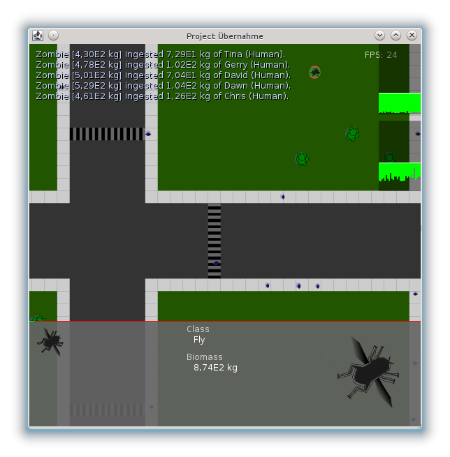

.. Copyright © 2012-2014, 2016-2017 Martin Ueding <dev@martin-ueding.de>

#################
project-ubernahme
#################

This is the biggest game I have written so far. It was thought of as a mash up
of various other games, but it became so big that it got stuck in itself. We
wanted to implement a ton of more features, which never happened since the class
interfaces became way to messy.

The cool thing about that game is though that it uses only vector graphics and
scales well. The downside is that it is a resource hog and does not run
smoothly on big screens. On a Core i5 and a :math:`1920 \times 1000` window it
runs with some 25 FPS, but a Core 2 Duo can only do it in a little window.

Download
========

- `<projectubernahme.jar>`_
